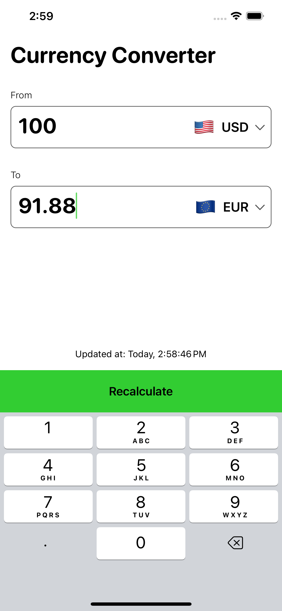
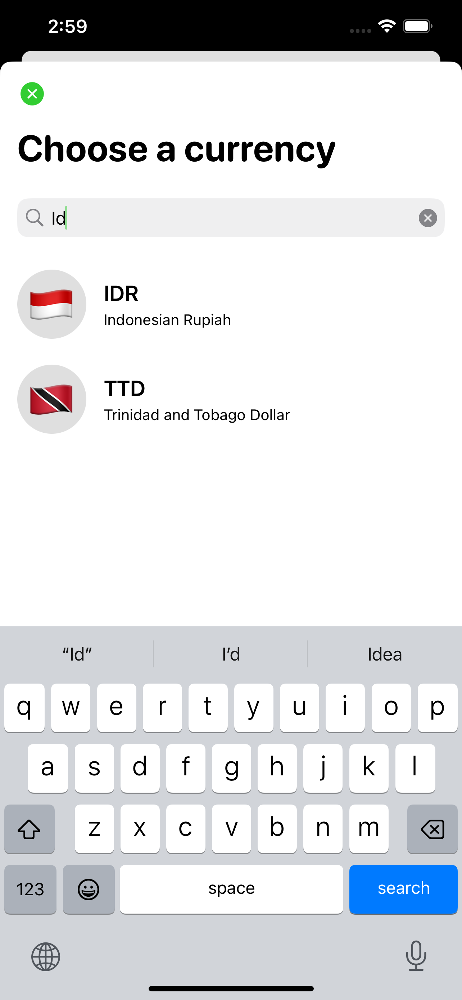

# WiseCurrencyConverter
This project is a native iOS currency converter app, inspired by Wise app's UI design. It showcases advanced practices and uses the MVP architecture for clean, modular code. It uses the openexchangerates.org API (replaceable via Dependency Injection), demonstrating proficiency in Swift programming, UI design, API handling, and data management. Comprehensive unit testing and UI testing are implemented, contributing to high code reliability and user experience.

  
  

